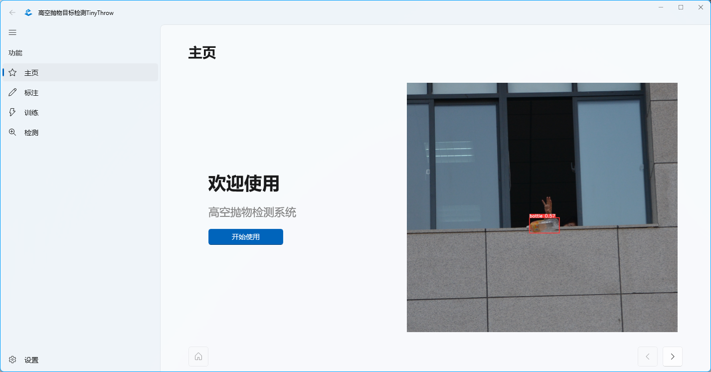

# ThrowObjectDetectionWinUI
## 高空抛物目标检测TinyThrow
**我的研究生课题《一种基于YOLOv5改进的轻量实时高空抛物目标检测算法TinyThrow》**  
[主页/Homepage](https://tiny.zerokirby.cn)  
基于 **WinUI 3.0** ，使用 **Windows App SDK 1.2.2 (1.2.221209.1)** 构建。  

# 下载
## 最新版本
**v1.0.0.0**  
## 系统要求
Windows **11**  
Windows **10** (October 2018 Update) build **17763** / version **1809** 以上
## TinyThrow本体
[阿里云盘](https://www.aliyundrive.com/s/Kvg6YSiVEQu) [百度网盘](https://pan.baidu.com/s/1LRoIljunazwYrNETvSUeyg?pwd=olgr) [蓝奏云](https://0kirby.lanzouf.com/iQkPj0l5dkza) [Github Releases](https://github.com/0Kirby/ThrowObjectDetectionWinUI/releases/latest)  
## ~~TinyThrow算法~~
~~尚未公开~~  
## YOLOv5算法
[Github Releases](https://github.com/ultralytics/yolov5/releases/latest)  

# 关于
由于高空抛物场景下的**背景分辨率较大、物品目标较小**等原因，导致当前的目标检测算法在该应用场景下存在**检测实时性较差、检测精度较低**等问题。  
针对上述挑战提出了一种基于YOLOv5改进的轻量实时高空抛物目标检测算法TinyThrow。实验结果表明，TinyThrow算法在文件大小仅为**3.9MB**的权重上，检测速度达到了**37.3FPS**，平均精确率达到了**85.5%**，与原始算法相比提升了**4.5%**，满足了***轻量实时高空抛物目标检测***的任务要求。

# 功能
## 标注
使用labelImg进行高空抛物照片标注。
## 训练
使用Pytorch对模型进行训练。
## 检测
使用模型对高空抛物图片进行检测。

# 特性
## 最新UI
使用最新的WinUI3，支持Windows11的新特性。
## 可视化界面
一改传统算法的命令行操作，提供图形化界面方便用户使用。
## 改进算法
针对通用目标检测算法进行改进，更加适合高空抛物场景，获得更优的算法性能。
## 轻量级
Nano模型仅需3.9MB的权重大小，即可达到优良的检测效果，适合部署于嵌入式设备。
## 自由定制
配置详细，支持用户自定义算法规模、文件路径，得到最适合自己的模型。
## 操作友好
一站式提供高空抛物目标检测所需的全部功能。

# 创新
## TinyThrow相较于YOLOv5的改进
1. **创新点1**  
2. **创新点2**  
3. **创新点3**  

等待解锁中...  
敬请期待！  

# 依赖
## 为确保程序正常运行需要安装好对应的Python包
- python≥3.9.0
- CUDA==11.3
- torch≥1.10.0
- torchvision≥0.8.1
- tensorboard≥2.4.1
- labelImg≥1.8.6

# FAQ
## 如何使用本系统？
请打开软件后按照流程提示进行操作，清晰明了，简单易懂。
## 运行软件需要什么配置条件?
Windows 10/11 64位操作系统，推荐nVidia显卡显存大于4G（如果无符合要求的显卡可使用CPU），CPU大于i5，内存大于8G。
## 可以不安装labelImg吗?
可以。但是请使用其他图片标注工具生成符合YOLO格式的标注。
## 超参数可以自定义哪些？
输入图片分辨率、每次迭代的图片张数、训练总轮数、算法配置文件、算法规模、数据集和算法文件夹等。
## 为什么训练不支持将输出在程序内显示？
由于产生的输出较多，暂不支持重定向到窗口中显示，请在命令行界面中查看输出。
## 如何找到算法输出文件夹？
训练得到的权重文件.pt将保存在runs\train\exp[xxx]\weights文件夹中，可点击输出路径中的“蓝色链接”打开，分为最佳权重和最后权重。

# 联系我
QQ：[623768813](http://wpa.qq.com/msgrd?v=3&uin=623768813&site=qq&menu=yes)  
E-mail：[jty.1234567890@163.com](mailto:jty.1234567890@163.com)  
Twitter：[@xqjtqy](https://twitter.com/xqjtqy)  
TinyThrow官方网站：https://tiny.zerokirby.cn  
个人主页：https://zerokirby.cn  
博客：https://blog.zerokirby.cn